# Startup Optimizations Summary

Full profiling report: [startup_profile_report.md](startup_profile_report.md)

This document consolidates the SGLang and Megatron startup changes implemented
during profiling, what each one does, and measured speedups on SkyPilot
`swapserve-qwen` (Qwen3-4B, 2x A100-80GB, TP=2, short debug-rollout benchmark
unless noted).

## Optimization speedup overview

| Optimization | Area | What changed | Measured speedup | Kept? |
| --- | --- | --- | --- | --- |
| Warm external SGLang engine | SGLang | Pre-launch SGLang; Slime connects with `--rollout-external` | **~100s** on `sglang_rollout_server_start` (`114.3s → 13.9s`) | Yes |
| `/health` startup readiness | SGLang | Wait on `/health` instead of `/health_generate` during startup | **~13s** on managed cold rollout (`114.3s → 101.0s`) | Yes |
| Router readiness polling | SGLang | TCP poll replaces fixed `time.sleep(3)` after router launch | **~2.9s** (`~3.0s → 0.1s`) | Yes |
| Bounded startup health polling | SGLang | HTTP timeout + shorter backoff instead of unbounded 2s sleeps | **~0.2s** on warm path (within noise) | Yes |
| CPU-only external wrapper actors | SGLang | External rollout Ray wrappers use CPU, not GPU bundles | No meaningful regression; avoids GPU reservation | Yes |
| Megatron batched actor launch | Megatron | CPU helper picks `MASTER_ADDR`/`MASTER_PORT`; all ranks submitted in parallel | **~16s** on `megatron_actor_init` (`56.9s → 41.3s` isolated; `36.9s → 21.0s` e2e naive vs optimized) | Yes |
| Port allocation batching | SGLang | One Ray RPC per node for all free ports | **~0.2s** only (`12.96s → 12.76s`); not a meaningful win | Kept (correctness), not prioritized |
| Reduced CUDA graph coverage | SGLang | Lower `--sglang-cuda-graph-max-bs` or piecewise token cap | Up to **~17s** startup, but throughput regressed | Rejected for production |

Combined end-to-end (naive cold → warm + all kept optimizations):

| Metric | Naive cold | Optimized warm | Savings |
| --- | ---: | ---: | ---: |
| `sglang_rollout_server_start` | 112.5s | 14.2s | **98.4s** |
| `megatron_actor_init` | 36.9s | 21.0s | **15.9s** |
| **Total through `initial_weight_update`** | **153.1s** | **38.8s** | **114.3s (74.7%)** |

---

<a id="sglang-optimizations"></a>

## SGLang optimizations

SGLang dominates startup because managed cold launch pays model load, CUDA graph
capture (~57s combined for regular + piecewise graphs), and health/registration
waits inside `sglang_rollout_server_start`. Three classes of optimization were
explored: managed-startup tweaks, warm external reuse, and CUDA graph tuning.

### 1. Warm external engine (largest win)

**Problem:** In the managed/cold path, every Slime job synchronously launches an
SGLang HTTP server, loads weights, captures CUDA graphs, waits for health, and
registers with the router before training can begin. CUDA graph capture alone is
~57s and cannot be skipped without hurting inference throughput.

**Change:** Pre-launch SGLang outside Slime (`python -m sglang.launch_server ...`).
Run Slime with `--rollout-external` and
`--rollout-external-engine-addrs host:port`. Slime validates the engine and
registers it with its router; generation still goes through the normal router
URL. Code: [`slime/backends/sglang_utils/sglang_engine.py`](slime/backends/sglang_utils/sglang_engine.py),
[`scripts/benchmark-qwen3-4b-warm-startup.sh`](scripts/benchmark-qwen3-4b-warm-startup.sh).

**Why it is faster:** Steps 4–8 of managed startup (server boot, model load, graph
capture, health wait) happen before the Slime job starts. When Slime starts it
only creates its router, validates `/health`, checks `/get_server_info`, and
registers the already-warm worker.

**Speedup:**

| Mode | `sglang_rollout_server_start` | `sglang_rollout_engine_init_wait` |
| --- | ---: | ---: |
| Managed cold (`/health_generate`) | 114.330s | 101.007s |
| Warm external (`/health`) | 13.903s | 13.567s |
| **Delta** | **100.427s faster** | **87.440s faster** |

**Tradeoff:** First engine boot is not faster; something else must keep the
external process alive. CUDA graph capture is amortized across repeated Slime
jobs.

### 2. `/health` instead of `/health_generate` for startup readiness

**Problem:** After SGLang prints "ready", `/health` returned HTTP 200 ~13s
before `/health_generate` became usable. Slime's old startup path blocked on
`/health_generate`, adding pure wait time after the server was already up.

**Change:** Managed and external startup validation now default to `/health`.
Override with `SLIME_SGLANG_STARTUP_HEALTH_ENDPOINT=/health_generate` if stricter
post-start validation is needed. Runtime fault-tolerance still uses
`/health_generate` during rollout. Code:
[`slime/backends/sglang_utils/sglang_engine.py`](slime/backends/sglang_utils/sglang_engine.py).

**Speedup (managed cold, router polling held constant):**

| Endpoint | `sglang_rollout_server_start` | Delta vs `/health_generate` |
| --- | ---: | ---: |
| `/health_generate` | 114.330s | baseline |
| `/health` | 101.048s | **13.282s faster** |

### 3. Router readiness polling

**Problem:** After launching the SGLang router subprocess, Slime always slept 3s
before continuing, even when the router port was reachable in ~0.1s.

**Change:** Replace `time.sleep(3)` with TCP port polling, 10s timeout, and an
error if the router process exits early. Code:
[`slime/ray/rollout.py`](slime/ray/rollout.py) (`sglang_router_wait_ready` phase).

**Speedup:** ~**2.9s** (`~3.0s fixed sleep → 0.102s` measured polling).

### 4. Bounded startup health polling + CPU-only external wrappers

**Problem:** Startup HTTP probes used unbounded requests and fixed 2s sleeps
between retries, adding jitter. External rollout wrapper actors previously
reserved GPU placement-group bundles even though they only issue HTTP calls.

**Change:**

- Startup health probes now use bounded HTTP timeouts and shorter exponential
  backoff ([`slime/backends/sglang_utils/sglang_engine.py`](slime/backends/sglang_utils/sglang_engine.py)).
- External wrapper actors schedule as CPU-only Ray actors, preserving health,
  weight update, and memory onload/offload methods without holding GPU bundles.

**Speedup:** **~0.2s** on warm external path (`14.143s → 13.903s`); within
run-to-run noise. Main value is lower jitter and correct GPU accounting.

### 5. Experiments not adopted

| Experiment | Result | Decision |
| --- | --- | --- |
| Port allocation batching | `sglang_rollout_port_allocate.regular`: 12.956s → 12.759s | Kept for correctness; not a startup win on 2-GPU single-engine setup |
| `--sglang-cuda-graph-max-bs 32` | ~3s startup gain; decode fell off graph path at 256 concurrency | Rejected |
| `--sglang-piecewise-cuda-graph-max-tokens 512` | ~17s startup gain in 512-token debug rollout | Rejected for prefill-heavy agentic workloads |

CUDA graph capture remains the dominant cost inside managed startup (~62% of
engine init wait). Warm external reuse is the only way to remove it from the
Slime job path without reducing graph coverage.

---

<a id="megatron-optimizations"></a>

## Megatron optimizations

Megatron startup splits into two phases:

1. **`megatron_actor_allocate`** — create Ray GPU workers, set distributed env
   vars (`MASTER_ADDR`, `MASTER_PORT`, `RANK`, `WORLD_SIZE`).
2. **`megatron_actor_init_wait`** — call `init()` on each worker: NCCL process
   group, HF config/tokenizer, checkpoint load, model/optimizer build.

The patch only optimizes phase 1. Phase 2 is unchanged (~18–39s depending on
run config).

### Problem: serial rank-0 GPU boot before rank 1 submission

Old code in [`slime/ray/actor_group.py`](slime/ray/actor_group.py) (pre-patch):

```python
for rank in range(world_size):
    actor = TrainRayActor.options(...).remote(world_size, rank, master_addr, master_port)
    if rank == 0:
        master_addr, master_port = ray.get(actor.get_master_addr_and_port.remote())
    self._actor_handlers.append(actor)
```

PyTorch distributed needs every rank to share the same `MASTER_ADDR` and
`MASTER_PORT` (the TCP rendezvous "meeting room" for NCCL bootstrap). In the old
path:

- Rank 0 was created with `master_addr=None`, so its GPU worker picked the node
  IP and a free port inside `TrainRayActor.__init__`.
- The driver **blocked on `ray.get()`** until rank 0's full GPU Ray worker was
  scheduled, started, and responded.
- Only then could rank 1 be submitted.

That created a serial dependency: rank 1 could not even be submitted until rank
0's heavy GPU worker finished booting (CUDA context, runtime env, placement group
GPU bundle acquisition). For 2 GPUs this cost **~18.5s** in `megatron_actor_allocate`.

### Change: lightweight CPU helper + batched GPU actor submit

New code adds `MasterEndpointActor` — a tiny CPU-only Ray actor
(`num_gpus=0`, `num_cpus=0.01`) scheduled on rank 0's placement bundle:

```python
@ray.remote(num_cpus=0.01, num_gpus=0)
class MasterEndpointActor:
    def get_master_addr_and_port(self):
        return get_current_node_ip(), get_free_port(...)
```

Flow:

1. Spawn `MasterEndpointActor` on rank 0's node (~2.3s).
2. `ray.get()` the `(ip, port)` pair.
3. `ray.kill()` the helper — it does not participate in training.
4. Submit **all** `MegatronTrainRayActor` GPU workers in one batch, passing the
   same endpoint to every rank.

The CPU helper's only job is discovering the rendezvous address on the correct
node. It avoids booting a full GPU worker just to learn two strings, and lets Ray
schedule all GPU training workers in parallel.

### Speedup

Isolated Megatron experiment (same command, only `actor_group.py` changed):

| Phase | Pre-patch (naive) | Post-patch (optimized) | Delta |
| --- | ---: | ---: | ---: |
| `megatron_actor_allocate` | 18.497s | 2.521s | **15.976s faster** |
| `megatron_actor_master_endpoint_allocate` | (inside allocate) | 2.314s | new sub-phase |
| `megatron_actor_actor_submit` | (inside allocate) | 0.032s | new sub-phase |
| `megatron_actor_init_wait` | 38.370s | 38.736s | unchanged |
| **`megatron_actor_init`** | **56.892s** | **41.283s** | **15.609s faster** |
| End-to-end through `initial_weight_update` | 161.132s | 143.877s | **17.255s faster** |

End-to-end benchmark (naive cold SGLang + naive Megatron vs warm SGLang + optimized Megatron):

| Sub-phase | Naive cold | Warm + optimized | Delta |
| --- | ---: | ---: | ---: |
| `megatron_actor_allocate` | 18.637s | 2.491s | **16.146s faster** |
| `megatron_actor_init_wait` | 18.263s | 18.484s | unchanged |
| **`megatron_actor_init`** | **36.917s** | **20.993s** | **15.924s faster** |

**Why `init_wait` did not improve:** model load, `dist.init_process_group`, HF
config/tokenizer, and checkpoint restore are the same regardless of how Ray
actors were submitted. The patch removes Ray orchestration overhead, not Megatron
initialization work.

**What was not changed:** optimizer setup, checkpoint format, KL/ref loading,
weight backup, rollout weight update, or training loop behavior.

Code: [`slime/ray/actor_group.py`](slime/ray/actor_group.py). Naive baseline
preserved in [`scripts/fixtures/actor_group_naive_megatron.py`](scripts/fixtures/actor_group_naive_megatron.py)
for benchmarking. End-to-end benchmark:
[`scripts/benchmark-qwen3-4b-e2e-startup.sh`](scripts/benchmark-qwen3-4b-e2e-startup.sh).

### `megatron_actor_init_wait` breakdown (measured 2026-05-20)

Full training path (**no `--debug-rollout-only`**) profiled via
[`scripts/benchmark-qwen3-4b-megatron-init-profile.sh`](scripts/benchmark-qwen3-4b-megatron-init-profile.sh)
on SkyPilot `swapserve-qwen` (2x A100-80GB, Qwen3-4B TP=2, colocate,
`--sglang-mem-fraction-static 0.20`, `--use-kl-loss --kl-loss-coef 0.00`).

**Note:** End-to-end benchmarks that use `--debug-rollout-only` skip Megatron
`init()` entirely; their **~18s** `megatron_actor_init_wait` is Ray RPC overhead
only, not this breakdown. Full training `init_wait` is **~39s**.

| Phase | Time (slowest rank) | Share of `init_wait` |
| --- | ---: | ---: |
| `megatron_actor_init_wait` (parent) | **38.718s** | 100% |
| `actor.distributed_init` | 0.725s | 1.9% |
| `actor.hf_config_tokenizer_load` | 2.058s | 5.3% |
| `actor.model_optimizer_checkpoint_load` | 8.648s | 22.3% |
| `actor.weights_backup.actor` | 3.141s | 8.1% |
| `actor.ref_checkpoint_load` | 5.466s | 14.1% |
| **Instrumented sub-phases (sum)** | **~20.0s** | **~52%** |
| **Untimed remainder** | **~18.7s** | **~48%** |

The **~18.7s untimed remainder** is not missing work; it is phases without
`SLIME_STARTUP_PROFILE` timers today, mainly:

- `TrainRayActor.init` — first `dist.init_process_group`, gloo group, NUMA affinity
- `TensorBackuper` / `UpdateWeightFromTensor` construction after ref load
- `clear_memory`, profiler setup, and Ray scheduling jitter between rank completions

Per-rank sub-phase times are similar (TP0 vs TP1 within ~0.2s). Parent
`init_wait` waits on `ray.get()` for **both** ranks, so the parent timer matches
the slowest rank's full `init()` path.

**Largest instrumented costs inside `init_wait`:**

1. **`actor.model_optimizer_checkpoint_load` (~8.6s)** — build DDP model + optimizer, load `--load` checkpoint
2. **`actor.ref_checkpoint_load` (~5.5s)** — second full checkpoint read from `--ref-load`
3. **`actor.weights_backup.actor` (~3.1s)** — first actor weight backup to CPU/GPU stash

### `init_wait` optimization opportunities

| Lever | Measured or estimated impact | Notes |
| --- | --- | --- |
| Skip ref checkpoint when KL unused | **~5.5s** (~14% of `init_wait`) | See ref-load evaluation below |
| HF config/tokenizer load dedup | **~1–2s** | Serialized per local rank with gloo barriers today |
| Checkpoint / optimizer tuning | **~0–10s** | Dominated by `--load` I/O and optimizer build (~8.6s) |
| Instrument + optimize untimed `TrainRayActor.init` | **unknown; likely several seconds** | Needs NVTX or new startup phases |
| Overlap Megatron init with SGLang (non-colocate) | **0s on metric**, wall-clock gain | Not applicable on 2-GPU colocate Qwen3-4B |
| Warm persistent Megatron Ray actors | **~30s+** on repeat jobs | No `--train-external` equivalent today |

### Ref-load evaluation (Qwen3-4B runs)

**Current gating** in [`slime/ray/placement_group.py`](slime/ray/placement_group.py):

```python
with_ref=actor_args.kl_coef != 0 or actor_args.use_kl_loss
```

**Qwen3-4B profiling/training commands use:**

```text
--use-kl-loss --kl-loss-coef 0.00 --kl-coef 0.00
```

So `with_ref=True` even though both KL coefficients are zero. That loads a second
full Megatron checkpoint from `--ref-load` (`/root/Qwen3-4B_torch_dist`) and
backs it up as `"ref"`, costing **~5.5s** at startup.

**Why ref is loaded today:** when `"ref"` is in `weights_backuper.backup_tags`,
[`train_actor`](slime/backends/megatron_utils/actor.py) switches to the ref
weights and runs `compute_log_prob(..., store_prefix="ref_")` before the policy
forward, even when `kl_loss_coef=0`. The KL term in the loss is zero, but ref
log-probs are still computed and logged.

**Safe skip condition (not implemented):** skip ref load only if **both**
`kl_coef == 0` and `kl_loss_coef == 0`, **and** training is changed to skip the
ref forward pass when ref weights are not loaded. A minimal gate change to
`with_ref=(kl_coef != 0 or kl_loss_coef != 0)` alone would break training for
current Qwen3-4B configs that keep `--use-kl-loss` with zero coefficient.

**Recommendation:** treat ref skip as a **~5.5s** startup win paired with a
train-path change (skip ref forward when `kl_loss_coef == 0 and kl_coef == 0`),
not as a one-line `with_ref` change under the current `--use-kl-loss` defaults.

---

## How the optimizations compose

```mermaid
flowchart TB
    subgraph naive [Naive cold startup ~153s]
        N1[Ray placement ~1s]
        N2["SGLang managed launch + graphs + /health_generate ~112s"]
        N3["Megatron serial GPU actor create ~19s"]
        N4["Megatron init_wait ~39s full training"]
        N5[initial_weight_update ~0s]
        N1 --> N2 --> N3 --> N4 --> N5
    end

    subgraph optimized [Optimized warm startup ~39s]
        O1[Ray placement ~1s]
        O2["SGLang external validate + register ~14s"]
        O3["Megatron CPU helper + parallel GPU submit ~2.5s"]
        O4["Megatron init_wait ~39s full training"]
        O5[initial_weight_update ~0s]
        O1 --> O2 --> O3 --> O4 --> O5
    end
```



SGLang warm external accounts for **~86%** of end-to-end savings; Megatron batched
launch accounts for **~14%**. Both are independent: use warm SGLang for rollout
serving wins, Megatron patch for training actor launch wins, and together they
reduce Slime job startup from **153s to 39s** without changing inference graph
coverage or training correctness.
