# Qwen3-4B Startup Profile Report

Source logs: SkyPilot `swapserve-qwen` startup profiling runs on 2026-05-19.

Latest follow-up run used temporary startup instrumentation around router
readiness, rollout actor setup, port allocation, and SGLang HTTP readiness.
The run continued past startup into eval, so the startup question was answered
before the full command completed.

## Summary

Startup is dominated by SGLang rollout server startup. In this run,
`sglang_rollout_server_start` took **132.776s**, of which
`sglang_rollout_engine_init_wait` took **117.001s**.

Inside the SGLang child process, the largest visible costs are CUDA graph setup:

- Regular CUDA graph capture: **27.55s**
- Piecewise CUDA graph capture/compile: **45.00s**

Together, those two CUDA graph phases account for about **72.55s**, or about
**62%** of `sglang_rollout_engine_init_wait`.

The first run later failed during Megatron actor initialization with a CUDA OOM
while allocating Megatron gradient buffers. The follow-up run lowered
`--sglang-mem-fraction-static` to `0.35` and got past Megatron init.

With all optimizations applied (warm external SGLang + Megatron actor launch
patch), end-to-end Slime startup through the first weight update dropped from
**153.1s** (naive cold) to **38.8s** — a **114.3s (74.7%)** reduction. See
[Startup Optimizations Summary](#startup-optimizations-summary) for what changed,
why it helped, and per-optimization speedups.

## Startup Optimizations Summary

This section consolidates the SGLang and Megatron startup changes implemented
during profiling, what each one does, and measured speedups on SkyPilot
`swapserve-qwen` (Qwen3-4B, 2x A100-80GB, TP=2, short debug-rollout benchmark
unless noted).

### Optimization speedup overview

| Optimization | Area | What changed | Measured speedup | Kept? |
| --- | --- | --- | --- | --- |
| Warm external SGLang engine | SGLang | Pre-launch SGLang; Slime connects with `--rollout-external` | **~100s** on `sglang_rollout_server_start` (`114.3s → 13.9s`) | Yes |
| `/health` startup readiness | SGLang | Wait on `/health` instead of `/health_generate` during startup | **~13s** on managed cold rollout (`114.3s → 101.0s`) | Yes |
| Router readiness polling | SGLang | TCP poll replaces fixed `time.sleep(3)` after router launch | **~2.9s** (`~3.0s → 0.1s`) | Yes |
| Bounded startup health polling | SGLang | HTTP timeout + shorter backoff instead of unbounded 2s sleeps | **~0.2s** on warm path (within noise) | Yes |
| CPU-only external wrapper actors | SGLang | External rollout Ray wrappers use CPU, not GPU bundles | No meaningful regression; avoids GPU reservation | Yes |
| Megatron batched actor launch | Megatron | CPU helper picks `MASTER_ADDR`/`MASTER_PORT`; all ranks submitted in parallel | **~16s** on `megatron_actor_init` (`56.9s → 41.3s` isolated; `36.9s → 21.0s` e2e naive vs optimized) | Yes |
| Port allocation batching | SGLang | One Ray RPC per node for all free ports | **~0.2s** only (`12.96s → 12.76s`); not a meaningful win | Kept (correctness), not prioritized |
| Reduced CUDA graph coverage | SGLang | Lower `--sglang-cuda-graph-max-bs` or piecewise token cap | Up to **~17s** startup, but throughput regressed | Rejected for production |

Combined end-to-end (naive cold → warm + all kept optimizations):

| Metric | Naive cold | Optimized warm | Savings |
| --- | ---: | ---: | ---: |
| `sglang_rollout_server_start` | 112.5s | 14.2s | **98.4s** |
| `megatron_actor_init` | 36.9s | 21.0s | **15.9s** |
| **Total through `initial_weight_update`** | **153.1s** | **38.8s** | **114.3s (74.7%)** |

---

### SGLang optimizations

SGLang dominates startup because managed cold launch pays model load, CUDA graph
capture (~57s combined for regular + piecewise graphs), and health/registration
waits inside `sglang_rollout_server_start`. Three classes of optimization were
explored: managed-startup tweaks, warm external reuse, and CUDA graph tuning.

#### 1. Warm external engine (largest win)

**Problem:** In the managed/cold path, every Slime job synchronously launches an
SGLang HTTP server, loads weights, captures CUDA graphs, waits for health, and
registers with the router before training can begin. CUDA graph capture alone is
~57s and cannot be skipped without hurting inference throughput.

**Change:** Pre-launch SGLang outside Slime (`python -m sglang.launch_server ...`).
Run Slime with `--rollout-external` and
`--rollout-external-engine-addrs host:port`. Slime validates the engine and
registers it with its router; generation still goes through the normal router
URL. Code: [`slime/backends/sglang_utils/sglang_engine.py`](slime/backends/sglang_utils/sglang_engine.py),
[`scripts/benchmark-qwen3-4b-warm-startup.sh`](scripts/benchmark-qwen3-4b-warm-startup.sh).

**Why it is faster:** Steps 4–8 of managed startup (server boot, model load, graph
capture, health wait) happen before the Slime job starts. When Slime starts it
only creates its router, validates `/health`, checks `/get_server_info`, and
registers the already-warm worker.

**Speedup:**

| Mode | `sglang_rollout_server_start` | `sglang_rollout_engine_init_wait` |
| --- | ---: | ---: |
| Managed cold (`/health_generate`) | 114.330s | 101.007s |
| Warm external (`/health`) | 13.903s | 13.567s |
| **Delta** | **100.427s faster** | **87.440s faster** |

**Tradeoff:** First engine boot is not faster; something else must keep the
external process alive. CUDA graph capture is amortized across repeated Slime
jobs.

#### 2. `/health` instead of `/health_generate` for startup readiness

**Problem:** After SGLang prints "ready", `/health` returned HTTP 200 ~13s
before `/health_generate` became usable. Slime's old startup path blocked on
`/health_generate`, adding pure wait time after the server was already up.

**Change:** Managed and external startup validation now default to `/health`.
Override with `SLIME_SGLANG_STARTUP_HEALTH_ENDPOINT=/health_generate` if stricter
post-start validation is needed. Runtime fault-tolerance still uses
`/health_generate` during rollout. Code:
[`slime/backends/sglang_utils/sglang_engine.py`](slime/backends/sglang_utils/sglang_engine.py).

**Speedup (managed cold, router polling held constant):**

| Endpoint | `sglang_rollout_server_start` | Delta vs `/health_generate` |
| --- | ---: | ---: |
| `/health_generate` | 114.330s | baseline |
| `/health` | 101.048s | **13.282s faster** |

#### 3. Router readiness polling

**Problem:** After launching the SGLang router subprocess, Slime always slept 3s
before continuing, even when the router port was reachable in ~0.1s.

**Change:** Replace `time.sleep(3)` with TCP port polling, 10s timeout, and an
error if the router process exits early. Code:
[`slime/ray/rollout.py`](slime/ray/rollout.py) (`sglang_router_wait_ready` phase).

**Speedup:** ~**2.9s** (`~3.0s fixed sleep → 0.102s` measured polling).

#### 4. Bounded startup health polling + CPU-only external wrappers

**Problem:** Startup HTTP probes used unbounded requests and fixed 2s sleeps
between retries, adding jitter. External rollout wrapper actors previously
reserved GPU placement-group bundles even though they only issue HTTP calls.

**Change:**

- Startup health probes now use bounded HTTP timeouts and shorter exponential
  backoff ([`slime/backends/sglang_utils/sglang_engine.py`](slime/backends/sglang_utils/sglang_engine.py)).
- External wrapper actors schedule as CPU-only Ray actors, preserving health,
  weight update, and memory onload/offload methods without holding GPU bundles.

**Speedup:** **~0.2s** on warm external path (`14.143s → 13.903s`); within
run-to-run noise. Main value is lower jitter and correct GPU accounting.

#### 5. Experiments not adopted

| Experiment | Result | Decision |
| --- | --- | --- |
| Port allocation batching | `sglang_rollout_port_allocate.regular`: 12.956s → 12.759s | Kept for correctness; not a startup win on 2-GPU single-engine setup |
| `--sglang-cuda-graph-max-bs 32` | ~3s startup gain; decode fell off graph path at 256 concurrency | Rejected |
| `--sglang-piecewise-cuda-graph-max-tokens 512` | ~17s startup gain in 512-token debug rollout | Rejected for prefill-heavy agentic workloads |

CUDA graph capture remains the dominant cost inside managed startup (~62% of
engine init wait). Warm external reuse is the only way to remove it from the
Slime job path without reducing graph coverage.

---

### Megatron optimizations

Megatron startup splits into two phases:

1. **`megatron_actor_allocate`** — create Ray GPU workers, set distributed env
   vars (`MASTER_ADDR`, `MASTER_PORT`, `RANK`, `WORLD_SIZE`).
2. **`megatron_actor_init_wait`** — call `init()` on each worker: NCCL process
   group, HF config/tokenizer, checkpoint load, model/optimizer build.

The patch only optimizes phase 1. Phase 2 is unchanged (~18–39s depending on
run config).

#### Problem: serial rank-0 GPU boot before rank 1 submission

Old code in [`slime/ray/actor_group.py`](slime/ray/actor_group.py) (pre-patch):

```python
for rank in range(world_size):
    actor = TrainRayActor.options(...).remote(world_size, rank, master_addr, master_port)
    if rank == 0:
        master_addr, master_port = ray.get(actor.get_master_addr_and_port.remote())
    self._actor_handlers.append(actor)
```

PyTorch distributed needs every rank to share the same `MASTER_ADDR` and
`MASTER_PORT` (the TCP rendezvous "meeting room" for NCCL bootstrap). In the old
path:

- Rank 0 was created with `master_addr=None`, so its GPU worker picked the node
  IP and a free port inside `TrainRayActor.__init__`.
- The driver **blocked on `ray.get()`** until rank 0's full GPU Ray worker was
  scheduled, started, and responded.
- Only then could rank 1 be submitted.

That created a serial dependency: rank 1 could not even be submitted until rank
0's heavy GPU worker finished booting (CUDA context, runtime env, placement group
GPU bundle acquisition). For 2 GPUs this cost **~18.5s** in `megatron_actor_allocate`.

#### Change: lightweight CPU helper + batched GPU actor submit

New code adds `MasterEndpointActor` — a tiny CPU-only Ray actor
(`num_gpus=0`, `num_cpus=0.01`) scheduled on rank 0's placement bundle:

```python
@ray.remote(num_cpus=0.01, num_gpus=0)
class MasterEndpointActor:
    def get_master_addr_and_port(self):
        return get_current_node_ip(), get_free_port(...)
```

Flow:

1. Spawn `MasterEndpointActor` on rank 0's node (~2.3s).
2. `ray.get()` the `(ip, port)` pair.
3. `ray.kill()` the helper — it does not participate in training.
4. Submit **all** `MegatronTrainRayActor` GPU workers in one batch, passing the
   same endpoint to every rank.

The CPU helper's only job is discovering the rendezvous address on the correct
node. It avoids booting a full GPU worker just to learn two strings, and lets Ray
schedule all GPU training workers in parallel.

#### Speedup

Isolated Megatron experiment (same command, only `actor_group.py` changed):

| Phase | Pre-patch (naive) | Post-patch (optimized) | Delta |
| --- | ---: | ---: | ---: |
| `megatron_actor_allocate` | 18.497s | 2.521s | **15.976s faster** |
| `megatron_actor_master_endpoint_allocate` | (inside allocate) | 2.314s | new sub-phase |
| `megatron_actor_actor_submit` | (inside allocate) | 0.032s | new sub-phase |
| `megatron_actor_init_wait` | 38.370s | 38.736s | unchanged |
| **`megatron_actor_init`** | **56.892s** | **41.283s** | **15.609s faster** |
| End-to-end through `initial_weight_update` | 161.132s | 143.877s | **17.255s faster** |

End-to-end benchmark (naive cold SGLang + naive Megatron vs warm SGLang + optimized Megatron):

| Sub-phase | Naive cold | Warm + optimized | Delta |
| --- | ---: | ---: | ---: |
| `megatron_actor_allocate` | 18.637s | 2.491s | **16.146s faster** |
| `megatron_actor_init_wait` | 18.263s | 18.484s | unchanged |
| **`megatron_actor_init`** | **36.917s** | **20.993s** | **15.924s faster** |

**Why `init_wait` did not improve:** model load, `dist.init_process_group`, HF
config/tokenizer, and checkpoint restore are the same regardless of how Ray
actors were submitted. The patch removes Ray orchestration overhead, not Megatron
initialization work.

**What was not changed:** optimizer setup, checkpoint format, KL/ref loading,
weight backup, rollout weight update, or training loop behavior.

Code: [`slime/ray/actor_group.py`](slime/ray/actor_group.py). Naive baseline
preserved in [`scripts/fixtures/actor_group_naive_megatron.py`](scripts/fixtures/actor_group_naive_megatron.py)
for benchmarking. End-to-end benchmark:
[`scripts/benchmark-qwen3-4b-e2e-startup.sh`](scripts/benchmark-qwen3-4b-e2e-startup.sh).

---

### How the optimizations compose

```mermaid
flowchart TB
    subgraph naive [Naive cold startup ~153s]
        N1[Ray placement ~1s]
        N2["SGLang managed launch + graphs + /health_generate ~112s"]
        N3["Megatron serial GPU actor create ~19s"]
        N4["Megatron init_wait ~18s"]
        N5[initial_weight_update ~0s]
        N1 --> N2 --> N3 --> N4 --> N5
    end

    subgraph optimized [Optimized warm startup ~39s]
        O1[Ray placement ~1s]
        O2["SGLang external validate + register ~14s"]
        O3["Megatron CPU helper + parallel GPU submit ~2.5s"]
        O4["Megatron init_wait ~18s"]
        O5[initial_weight_update ~0s]
        O1 --> O2 --> O3 --> O4 --> O5
    end
```



SGLang warm external accounts for **~86%** of end-to-end savings; Megatron batched
launch accounts for **~14%**. Both are independent: use warm SGLang for rollout
serving wins, Megatron patch for training actor launch wins, and together they
reduce Slime job startup from **153s to 39s** without changing inference graph
coverage or training correctness.

## Follow-up Profiling Result

Among the four suspected non-CUDA-graph startup costs, the main culprit is the
SGLang startup readiness path, specifically waiting for `/health_generate`
instead of the lighter `/health` endpoint. The second largest confirmed culprit
is Ray-based rollout engine address/port allocation.


| Candidate                                    | Measured result                                                                 | Conclusion                                                                               |
| -------------------------------------------- | ------------------------------------------------------------------------------- | ---------------------------------------------------------------------------------------- |
| SGLang post-ready health lag                 | `/health` returned 200 at 19:25:13; `/health_generate` returned 200 at 19:25:26 | Main fix target. Using `/health` for startup readiness could save about 13s in this run. |
| Pre-engine setup before init wait            | `sglang_rollout_port_allocate.regular` took 12.956s                             | Real culprit for the pre-wait gap. It is not `_make_group` or actor construction.        |
| Router fixed sleep                           | Router readiness polling completed in 0.101s                                    | The old 3s sleep is easy to remove and saved almost the full 3s.                         |
| `_make_group` / actor creation / init submit | `_make_group`: 0.000s, actor creation: 0.044s, init submit: 0.000s              | Not meaningful contributors.                                                             |


The key timestamps from the follow-up run:

- Router launched at 19:23:33 after `sglang_router_wait_ready=0.101s`.
- `sglang_rollout_port_allocate.regular` ran from 19:23:33 to 19:23:46 and took 12.956s.
- `sglang_rollout_engine_init_wait` ran from 19:23:46 to 19:25:27 and took 100.865s.
- SGLang printed `The server is fired up and ready to roll!` at 19:25:12.
- `/health` returned HTTP 200 at 19:25:13.
- `/health_generate` returned HTTP 200 at 19:25:26.
- `sglang_rollout_server_start` took 114.162s in the follow-up run.

This means the old "server-ready to Slime-ready" gap is not just coarse 2s
polling. `/health_generate` itself became usable much later than `/health`.
For startup readiness, Slime should likely wait on `/health`, then use
`/health_generate` only for runtime health checks or for an optional stricter
post-start validation.

## Completed Timings


| Phase                                       | Time     | Code area                                                               | What it means                                                                                                     |
| ------------------------------------------- | -------- | ----------------------------------------------------------------------- | ----------------------------------------------------------------------------------------------------------------- |
| `ray_placement`                             | 0.993s   | `slime/ray/placement_group.py:create_placement_groups`                  | Creates the Ray placement group for 2 GPUs and maps logical bundles to physical GPUs.                             |
| `ray_placement_ready`                       | 0.003s   | `slime/ray/placement_group.py:_create_placement_group`                  | Waits for Ray placement group readiness.                                                                          |
| `ray_placement_gpu_map`                     | 0.930s   | `slime/ray/placement_group.py:_create_placement_group`                  | Starts temporary Ray actors to discover node/GPU mapping.                                                         |
| `sglang_rollout_startup`                    | 0.060s   | `train.py` / rollout manager creation                                   | Submits/starts the rollout manager actor.                                                                         |
| `rollout_data_source_init`                  | 2.723s   | `slime/ray/rollout.py:RolloutManager.__init__`                          | Loads and initializes the rollout prompt data source.                                                             |
| `rollout_function_load`                     | 0.028s   | `slime/ray/rollout.py:RolloutManager.__init__`                          | Imports the train/eval rollout functions.                                                                         |
| `sglang_rollout_server_start`               | 132.776s | `slime/ray/rollout.py:384` -> `start_rollout_servers`                   | Parent phase for router launch, engine group setup, Ray engine actors, engine init wait, and router registration. |
| `sglang_rollout_engine_init_submit.regular` | 0.000s   | `slime/ray/rollout.py:start_rollout_servers`                            | Submits the regular SGLang engine initialization Ray task.                                                        |
| `sglang_rollout_engine_init_wait`           | 117.001s | `slime/ray/rollout.py:1111`                                             | Waits on `ray.get(all_init_handles)` for SGLang engine startup and health readiness.                              |
| `megatron_actor_allocate`                   | 18.294s  | `slime/ray/placement_group.py:create_training_models` / `RayTrainGroup` | Allocates Megatron Ray actors on the placement group.                                                             |
| `megatron_actor_init_wait`                  | 21.278s  | `slime/ray/placement_group.py:create_training_models`                   | Waits for Megatron actor initialization Ray tasks.                                                                |
| `megatron_actor_init`                       | 39.573s  | `slime/ray/placement_group.py:create_training_models`                   | Parent phase covering actor allocation and initialization wait.                                                   |


Follow-up run additions:


| Phase                                       | Time     | What it means                                                                              |
| ------------------------------------------- | -------- | ------------------------------------------------------------------------------------------ |
| `sglang_router_wait_ready`                  | 0.101s   | Router port became reachable quickly; fixed 3s sleep is unnecessary.                       |
| `sglang_rollout_make_group.regular`         | 0.000s   | Group object construction is not the pre-wait bottleneck.                                  |
| `sglang_rollout_actor_create.regular`       | 0.044s   | Ray actor handle creation is not the pre-wait bottleneck.                                  |
| `sglang_rollout_port_allocate.regular`      | 12.956s  | Ray calls used to discover node IP and free ports explain almost all of the pre-wait gap.  |
| `sglang_rollout_engine_init_submit.regular` | 0.000s   | Init RPC submission is not measurable.                                                     |
| `sglang_rollout_engine_init_wait`           | 100.865s | Follow-up run wait time; includes SGLang boot, CUDA graphs, and `/health_generate` lag.    |
| `sglang_rollout_server_start`               | 114.162s | Follow-up run total rollout startup after router polling and lower SGLang memory fraction. |


## SGLang Engine Details

These timings are from SGLang's own logs inside `sglang_rollout_engine_init_wait`.


| SGLang step                              | Time                          | Notes                                                                                         |
| ---------------------------------------- | ----------------------------- | --------------------------------------------------------------------------------------------- |
| Server args printed / server boot begins | ~11s after engine wait starts | `sglang_rollout_engine_init_wait` starts at 15:53:58; `server_args=...` appears at 15:54:09.  |
| Torch distributed init                   | ~1.9s                         | TP0: 1.89s, TP1: 1.98s.                                                                       |
| Weight load                              | ~1.2s                         | TP0: 1.19s, TP1: 1.16s for `Qwen3ForCausalLM`.                                                |
| KV cache allocation / memory pool        | <1s visible                   | Allocates 42,361 KV-cache tokens.                                                             |
| CUDA graph capture                       | 27.55s                        | Captures batch sizes `[1, 2, 4, 8, 12, ... 256]`.                                             |
| Piecewise CUDA graph capture/compile     | 45.00s                        | Compiles/captures token sizes `[4, 8, 12, ... 8192]`.                                         |
| Server readiness after piecewise graph   | ~1s                           | Server reports ready at 15:55:41.                                                             |
| Health-check / registration lag          | ~14s                          | Server is ready at 15:55:41; rollout wait ends at 15:55:55 after `/health_generate` succeeds. |


In the follow-up run, regular CUDA graph capture stayed roughly the same
(`27.47s` to `27.49s`), while piecewise CUDA graph capture was lower
(`29.13s` to `29.15s`). The follow-up run used different memory settings, so
use it mainly for relative diagnosis of the four suspected overheads rather
than as a strict apples-to-apples CUDA graph comparison.

## Breakdown Of `sglang_rollout_server_start`


| Component                             | Approx time         | Notes                                                                                                             |
| ------------------------------------- | ------------------- | ----------------------------------------------------------------------------------------------------------------- |
| Router launch                         | 0.101s with polling | The fixed `time.sleep(3)` can be replaced with readiness polling.                                                 |
| Engine group / port setup before wait | 12.956s             | Confirmed to be `sglang_rollout_port_allocate.regular`, mostly Ray calls to `_get_current_node_ip_and_free_port`. |
| SGLang engine init wait               | 117.001s            | Dominant component; includes SGLang server boot, model load, graph capture, health wait, and router registration. |
| Other overhead                        | ~0s-1s              | Remainder between the measured pieces and the parent phase.                                                       |


## Current Bottleneck

The main overall bottleneck is still **SGLang CUDA graph setup**, especially:

1. Piecewise CUDA graph capture/compile: **45.00s**
2. Regular CUDA graph capture: **27.55s**
3. Engine start before graph work and post-ready health/registration lag: roughly **25s** combined

If CUDA graph coverage must be preserved, the best non-throughput-impacting
optimization is to change startup readiness from `/health_generate` to
`/health`. The follow-up run shows this could recover about 13s without
changing graph coverage.

The port-allocation batching experiment reduced Ray RPC count, but did not
materially reduce the measured one-engine Qwen3-4B startup case; see
`Port Allocation Batching Experiment` below.

If the goal is faster startup profiling rather than peak inference performance,
the next experiment should reduce or disable SGLang CUDA graph capture, for
example by setting a smaller `--sglang-cuda-graph-bs`, lower
`--sglang-cuda-graph-max-bs`, smaller piecewise graph token list if supported,
or `--sglang-disable-cuda-graph` for a startup-only run.

## CUDA Graph Coverage Experiments

Three short debug-rollout-only trials were run with `--skip-eval-before-train`,
one rollout, and `--rollout-max-response-len 512`. This isolates SGLang startup
and rollout generation without the long AIME eval or Megatron training path.


| Trial                                          | Regular graph capture | Piecewise graph capture | Engine init wait | Rollout server start | Rollout throughput | Result                                                                                                                                                            |
| ---------------------------------------------- | --------------------- | ----------------------- | ---------------- | -------------------- | ------------------ | ----------------------------------------------------------------------------------------------------------------------------------------------------------------- |
| Baseline default graph coverage                | 27.36s-27.37s         | 28.99s                  | 101.309s         | 113.986s             | 22.57 it/s         | Captured regular batch sizes through 256 and piecewise tokens through 8192. Decode used `cuda graph: True`.                                                       |
| `--sglang-cuda-graph-max-bs 32`                | 24.75s                | 28.57s                  | 97.873s          | 110.696s             | 11.20 it/s         | Startup improved only ~3.3s, but high-concurrency decode fell outside graph coverage and ran with `cuda graph: False`. Not acceptable for 256-concurrent rollout. |
| `--sglang-piecewise-cuda-graph-max-tokens 512` | 27.17s                | 11.81s                  | 83.806s          | 97.030s              | 22.67 it/s         | Best result for this short 512-token debug rollout, but not representative of prefill-heavy agentic traffic.                                                      |


## Observations

- The safest CUDA graph startup optimization tested for the **short 512-token
debug rollout** was reducing piecewise token coverage. This should not be
generalized to prefill-heavy agentic workloads without a separate prefill
throughput test.
- Regular graph capture time did not shrink much when `cuda_graph_max_bs` was
reduced from the default through 256 down to 32. The startup savings were only
about 2.6s-3.3s, while generation slowed by roughly 50% in the 256-concurrent
debug rollout.
- The bad `cuda_graph_max_bs=32` result is explainable from the logs: rollout
starts near 231-256 running requests, so most decode batches are larger than
the captured regular graph batch sizes and fall back to `cuda graph: False`.
- Piecewise token capping worked because the debug rollout response length was
capped at 512 tokens, but SGLang's default still compiled piecewise token
sizes through 8192. Capping the piecewise graph max to 512 removed unused graph
shapes for this run.
- For prefill-heavy agentic workloads, the 512-token piecewise cap is likely too
aggressive. Long prompts, tool histories, and multi-turn context can produce
large prefill/extend token batches that need higher piecewise graph coverage.
Reducing this cap could shift those batches off the optimized graph path and
increase time-to-first-token or end-to-end latency.
- The Modal blog's lesson applies here: CUDA graphs are expensive runtime
artifacts. If all graph coverage must be preserved, the realistic way to avoid
paying this cost repeatedly is warm-engine reuse, external engines, or
checkpoint/restore infrastructure, not smaller graph lists.
- For production `--rollout-max-response-len 8192`, especially with
prefill-heavy agentic traffic, the 512 cap should be treated as rejected unless
prefill metrics prove otherwise. The right cap should be chosen from observed
prefill/extend token distribution and validated with throughput and latency
logs.

The main finding is that capping regular graph batch size is risky for this
workload because rollout initially runs near 256 concurrent requests. Capping
piecewise CUDA graph token coverage preserved throughput only in the short
512-token debug rollout. For the user's prefill-heavy agentic workload, this is
not an acceptable default optimization.

For production settings with `--rollout-max-response-len 8192`, do not use the
512-token cap without a prefill-heavy benchmark. Instead, measure the real
prefill/extend token distribution and choose a cap/list that covers common
agentic prompt sizes. If the distribution is unknown, preserve the default
coverage or start with high caps only after measuring TTFT and prefill
throughput.

Warm-engine reuse remains the only route that can remove CUDA graph capture from
the hot path without reducing graph coverage. `SLIME_REUSE_RAY=1` only avoids
Ray startup. To reuse captured SGLang graphs across Slime jobs, pre-launch the
SGLang engine and connect with `--rollout-external` /
`--rollout-external-engine-addrs`, or keep a long-lived rollout service around
the training loop. This is the local analogue of the Modal blog's checkpoint /
ready-replica idea. Full CPU+GPU checkpoint/restore would also preserve
throughput, but it is an infrastructure project rather than a small Slime-side
change, especially for multi-GPU/NCCL engines.

## Warm External Rollout Engine Path

See [SGLang optimizations](#sglang-optimizations) in Startup Optimizations
Summary for the full list of SGLang changes and measured speedups.

This is the preferred CUDA-graph optimization for prefill-heavy agentic
workloads where generation speed must not regress. The SGLang engine pays CUDA
graph capture once, stays alive, and later Slime jobs connect to it instead of
launching a new engine.

The code path now supports this directly:

- Start one or more SGLang engines externally with the same model, host/port,
tensor parallel size, memory-saver/offload setting, and other SGLang args that
Slime expects.
- Run Slime with `--rollout-external` and
`--rollout-external-engine-addrs host:port ...`.
- Slime waits for `/health` by default (override with
  `SLIME_SGLANG_STARTUP_HEALTH_ENDPOINT`), checks `/get_server_info` against the
  expected `ServerArgs`, then registers the external engine with the Slime
  router so rollout generation still goes through the normal router URL.

Operational notes:

- For Qwen3-4B on two rollout GPUs, the external engine list usually has one
address because `--rollout-num-gpus-per-engine 2` creates one TP=2 engine.
- Keep the external SGLang process alive across Slime reruns. Do not run cleanup
commands that `pkill sglang` or `pkill python` in the same container.
- If training and rollout are colocated, the external engine must be launched
with settings compatible with Slime's offload expectation, or Slime should be
run with explicit `--no-offload-rollout` only if memory allows it.
- This does not make the first engine startup faster. It removes CUDA graph
capture from subsequent Slime job startup.

### Warm vs. Managed Startup Comparison

These runs used the same short debug-rollout-only setup: one rollout,
`--skip-eval-before-train`, `--rollout-max-response-len 512`, default CUDA graph
coverage, and router readiness polling. The fair comparison is to hold router
polling constant and vary only the SGLang readiness/ownership path.


| Mode                                               | Rollout startup path                                                             | `sglang_rollout_server_start` | `sglang_rollout_engine_init_wait` | CUDA graph capture in Slime startup                 | Rollout throughput                   |
| -------------------------------------------------- | -------------------------------------------------------------------------------- | ----------------------------- | --------------------------------- | --------------------------------------------------- | ------------------------------------ |
| Managed cold, `/health_generate` startup readiness | Slime launches SGLang, waits for graph capture, then waits for generation health | 114.330s                      | 101.007s                          | Yes: regular 27.37s-27.39s, piecewise 29.38s-29.41s | 22.75 it/s                           |
| Managed cold, `/health` startup readiness          | Slime launches SGLang, waits for graph capture, then stops at lightweight health | 101.048s                      | 88.006s                           | Yes: regular 27.54s-27.60s, piecewise 29.53s-29.58s | 10.75 it/s in this one short rollout |
| Warm external, `/health` startup readiness         | SGLang is pre-launched and healthy; Slime only validates and registers it        | 14.143s                       | 13.794s                           | No, graph capture was paid before Slime startup     | 22.93 it/s                           |
| Warm external after follow-up optimizations (2026-05-20) | Same as above, plus external `/health` default, bounded health polling, CPU-only external wrappers | 13.903s                       | 13.567s                           | No, graph capture was paid before Slime startup     | 58.58 tokens/gpu/s in one-sample debug rollout |


With router polling held constant, switching cold managed startup from
`/health_generate` to `/health` reduced rollout-server startup by **13.282s**
(`114.330s -> 101.048s`). Warm external with `/health` reduced Slime
rollout-server startup by **86.905s** versus the optimized cold `/health` path
(`101.048s -> 14.143s`) and by **100.187s** versus the strict cold
`/health_generate` path (`114.330s -> 14.143s`).

Re-running the same benchmark on 2026-05-20 after the follow-up optimizations
(`scripts/benchmark-qwen3-4b-warm-startup.sh` on SkyPilot `swapserve-qwen`, 2x
A100-80GB) measured **13.903s** rollout-server startup and **13.567s** engine
init wait. Versus naive cold `/health_generate`, that is **100.427s** faster on
rollout-server startup (`114.330s -> 13.903s`). Versus the prior warm external
measurement, the follow-up changes saved only **0.240s** on rollout-server
startup (`14.143s -> 13.903s`) and **0.227s** on engine init wait
(`13.794s -> 13.567s`), which is within run-to-run noise for this path.

This is the expected benefit: CUDA graph capture is not eliminated globally, but
it is moved out of the Slime job startup path and amortized across repeated
jobs.

### Managed Startup Readiness Optimization

Two non-CUDA-graph startup changes were implemented and kept because the managed
startup timing improved in the same short debug-rollout-only setup:

- `slime/backends/sglang_utils/sglang_engine.py` now waits for `/health` during
managed SGLang process startup instead of `/health_generate`.
- `slime/ray/rollout.py` now replaces the router's fixed `time.sleep(3)` with
TCP port readiness polling, a 10s timeout, and an error if the router process
exits before becoming reachable.

Measured result:


| Run                                            | Router wait         | Engine init wait | Rollout server start | Startup delta      |
| ---------------------------------------------- | ------------------- | ---------------- | -------------------- | ------------------ |
| Managed / cold baseline                        | ~3.000s fixed sleep | 100.994s         | 117.147s             | baseline           |
| Managed / cold with `/health` + router polling | 0.102s              | 86.002s          | 99.218s              | **17.929s faster** |


The original combined run improved by **17.929s** (`117.147s -> 99.218s`), which
mixed endpoint readiness and router polling. The cleaner follow-up held router
polling constant and measured `/health_generate` vs `/health` directly:
**13.282s** faster (`114.330s -> 101.048s`). The separate router polling win is
about **2.9s** versus the previous fixed sleep. The optimized run still captured
the default CUDA graph shapes and the SGLang logs showed decode using
`cuda graph: True`.

One caveat: this run's single-rollout progress bar showed `10.76 it/s`, lower
than the earlier `22.76 it/s` comparison run. The decode logs still showed CUDA
graphs enabled, and rollout length/sample randomness can move this number in a
one-rollout test, so treat this as a throughput caveat to recheck with a longer
multi-rollout benchmark before making any throughput claim. The startup change
was kept because the requested startup timing improved.

### Why The Warm Path Is Faster

In the managed/cold path, Slime does all rollout-serving work synchronously
inside `sglang_rollout_server_start`:

1. Launch router and wait for router port readiness.
2. Create Ray `SGLangEngine` actors.
3. Allocate engine ports.
4. Start the SGLang HTTP server process.
5. Load model weights.
6. Capture regular CUDA graphs.
7. Capture/compile piecewise CUDA graphs.
8. Wait for the configured startup health endpoint (`/health_generate` in the
  strict cold baseline, `/health` in the optimized cold path).
9. Register the engine with the router.

The expensive part is steps 4-8, especially CUDA graph setup. In the fair
comparison runs, regular graph capture took about **27.4s-27.6s** and piecewise
graph capture took about **29.4s-29.6s**. These costs are paid before Slime can
start rollout.

In the warm external path, steps 4-8 happen before the Slime job starts. When
Slime starts, it only:

1. Creates its router and lightweight Ray wrapper actor.
2. Checks that the external engine is healthy.
3. Fetches `/get_server_info` and validates expected server args.
4. Registers the already-warm engine with the router.

That is why Slime startup drops from **101.048s** in the optimized cold `/health`
path to **14.143s** in the warm external `/health` path. The CUDA graphs still
exist and are still used; they are just captured outside the measured Slime
startup path.

### Specific Optimization Made

The implementation change was to make external engines register with the Slime
router after they pass the existing external-engine sanity checks.

Before this change, `--rollout-external` validated a pre-launched SGLang engine,
but rollout generation still uses `args.sglang_router_ip:args.sglang_router_port`
as its `/generate` target. Without router registration, the Slime router would
not necessarily know about the external worker.

The updated path in `slime/backends/sglang_utils/sglang_engine.py` now:

- waits for the external engine's configured startup health endpoint
(`/health` in the latest comparison run);
- fetches `/get_server_info`;
- checks it against Slime's expected `ServerArgs`;
- registers the external engine with the Slime router using the same worker
registration logic as managed engines.

This makes the external-engine flow preserve the normal rollout request path:
rollout code still sends generation requests to the Slime router, while the
router forwards them to the already-warm SGLang worker.

### Tradeoffs And Risks

- **First startup is not faster.** The external SGLang process still pays model
load and CUDA graph capture once. The win appears on subsequent Slime jobs or
when the engine is warmed before it is needed.
- **Lifecycle management moves outside Slime.** Something else must start,
monitor, and eventually stop the external SGLang process. Slime will no longer
own the full engine lifecycle.
- **Argument parity matters.** The external engine must match Slime's expected
model path, TP size, dtype, memory settings, random seed, and other checked
SGLang server args. If they differ, Slime should fail early during sanity
check.
- **Colocation/offload is trickier.** If training and rollout share GPUs, the
warm external engine must be launched with compatible memory-saver/offload
behavior, or memory pressure can return. Running `--no-offload-rollout` is only
safe if there is enough GPU memory.
- **Stale weights are possible.** For training jobs that update rollout weights,
the external engine must still support the normal weight update endpoints and
distributed/tensor update path expected by Slime.
- **Failure recovery changes.** If the external process dies, Slime cannot simply
relaunch it as a managed child process. Recovery needs external supervision or
a wrapper that restarts and re-registers the engine.
- **Resource accounting is less automatic.** Because the warm engine is already
occupying GPU memory, job schedulers and cleanup scripts must avoid killing it
accidentally and must account for its reserved GPUs.

## Port Allocation Batching Experiment

Implemented a Slime-side batching patch for
`_allocate_rollout_engine_addr_and_ports_normal`:

- `RayActor` now has a batched helper that returns the current node IP plus all
  requested free port ranges in one remote call.
- Normal rollout port allocation builds one per-node allocation plan, calls the
  batched helper once per visited node, and then fills the same `host`, `port`,
  `nccl_port`, `dist_init_addr`, prefill bootstrap port, and cursor fields as
  before.
- SGLang launch settings, CUDA graph settings, health endpoint behavior, router
  polling, and external-engine registration were unchanged.

Focused validation:

```text
python -m pytest tests/test_rollout_port_allocation.py
3 passed
```

Local `pytest` was not installed, so the focused test was run inside
`slimerl/slime:latest`, matching the profiling environment.

Measured profiling result:

| Mode | Relevant timing | Result |
| --- | ---: | --- |
| Cold managed baseline | `sglang_rollout_port_allocate.regular = 12.956s` | Original follow-up run. |
| Cold managed with batched helper | `sglang_rollout_port_allocate.regular = 12.759s` | Only **0.197s faster**. The documented low-memory run later failed during SGLang startup with `mem_fraction_static=0.35`, so full cold startup was not comparable. |
| Warm external with batched helper | `sglang_rollout_server_start = 14.213s`, `sglang_rollout_engine_init_wait = 13.871s`, `sglang_rollout_port_allocate.regular = 0.000s` | No meaningful regression versus the prior warm external `/health` run (`14.143s`). |

Decision: the batching patch is behaviorally correct and does not regress the
warm external startup path, but it does **not** deliver a meaningful speedup in
the current single-engine Qwen3-4B setup. The original 12-13s allocation span is
therefore likely dominated by Ray actor scheduling/startup or first remote call
latency rather than the number of sequential port-allocation RPCs. This
optimization may matter more for multi-node or many-engine rollout layouts, but
it should not be presented as a major startup win for the current two-GPU run.

## Recommended Next Changes

1. Use pre-launched external SGLang rollout engines for prefill-heavy agentic
   workloads where graph coverage should be preserved.
2. Keep the new `/health` startup readiness path in both managed and external
   SGLang startup validation. Managed startup already used `/health`; the
   external warm path now does too, so repeated Slime jobs do not wait on
   `/health_generate` unless explicitly requested via
   `SLIME_SGLANG_STARTUP_HEALTH_ENDPOINT`.
3. Keep bounded, lower-jitter startup health polling. Startup HTTP probes now
   use a request timeout and shorter backoff instead of an unbounded request plus
   fixed 2s sleeps, reducing readiness jitter and avoiding stuck probes.
4. Keep external rollout wrapper actors CPU-only. When `--rollout-external` is
   set, Slime now keeps the existing Ray actor control surface for HTTP actions
   such as health checks, memory offload/onload, and weight updates, but no
   longer schedules those wrapper actors on GPU placement-group bundles.
5. Keep the new router readiness polling in `slime/ray/rollout.py`. The
   optimized run showed readiness in 0.102s instead of the previous 3s fixed
   sleep.
6. Do not prioritize further `_allocate_rollout_engine_addr_and_ports_normal`
   batching for the current single-engine Qwen3-4B setup. The batched helper
   reduced the measured allocation span only from 12.956s to 12.759s.
7. Do not adopt `--sglang-piecewise-cuda-graph-max-tokens 512` for prefill-heavy
   agentic workloads. Preserve broader/default piecewise graph coverage until
   prefill/extend token distributions and TTFT show a lower cap is safe.
8. Avoid `--sglang-cuda-graph-max-bs 32` for 256-concurrent rollout unless
   rollout concurrency is also reduced; it slowed generation substantially.
9. For future profiling commands, also disable eval-before-train or set the eval
   dataset/sample count very small. The follow-up command reached startup and
   then spent time in `Eval aime: 0/480`.

## Implemented Warm-Start Follow-Ups

The following additional warm-start improvements were implemented after the
measurements above and re-benchmarked on 2026-05-20 with
`scripts/benchmark-qwen3-4b-warm-startup.sh` on SkyPilot `swapserve-qwen`
(2x A100-80GB, one rollout, `--skip-eval-before-train`,
`--rollout-max-response-len 512`, `--debug-rollout-only`, default CUDA graphs):

- External SGLang startup validation now defaults to `/health`, matching the
  managed startup optimization. The warm comparison already used `/health`, so
  this mainly prevents regressions when the external path is used without an
  explicit `SLIME_SGLANG_STARTUP_HEALTH_ENDPOINT` override.
- Startup health polling now uses bounded HTTP requests and shorter exponential
  backoff instead of unbounded requests plus fixed 2s sleeps.
- External rollout wrapper actors now use CPU-only Ray scheduling instead of
  reserving GPU placement-group bundles, while preserving the HTTP control methods
  used by weight update, memory onload/offload, and health checks.

Measured warm-external result after these follow-ups:

| Phase | Before follow-ups | After follow-ups (2026-05-20) | Delta |
| --- | ---: | ---: | ---: |
| `sglang_router_wait_ready` | 0.101s | 0.101s | 0.000s |
| `sglang_rollout_port_allocate.regular` | 0.000s | 0.000s | 0.000s |
| `sglang_rollout_engine_init_wait` | 13.794s | 13.567s | **0.227s faster** |
| `sglang_rollout_server_start` | 14.143s | 13.903s | **0.240s faster** |

Versus naive cold managed startup with `/health_generate`
(`sglang_rollout_server_start = 114.330s`), the optimized warm-external path is
still **100.427s** faster (`114.330s -> 13.903s`). The follow-up code changes
did not materially move the warm path beyond the prior **14.143s** measurement;
the remaining warm startup time is still dominated by external-engine validation
and router registration inside `sglang_rollout_engine_init_wait`, not by CUDA
graph capture or port allocation.

## Megatron Actor Launch Experiment

See [Megatron optimizations](#megatron-optimizations) in Startup Optimizations
Summary for the problem statement, CPU-helper design, and speedup tables.

Implemented and measured a Megatron launch change on 2026-05-20. The change
keeps rank 0's `MASTER_ADDR`/`MASTER_PORT` allocation on rank 0's placement
bundle, but moves it into a lightweight CPU Ray helper actor. After the helper
returns the endpoint, Slime submits every `MegatronTrainRayActor` handle in one
batch instead of creating rank 0, waiting on `get_master_addr_and_port`, and then
continuing the actor creation loop.

The patch also adds startup profile phases for:

- `megatron_actor_master_endpoint_allocate`
- `megatron_actor_actor_submit`

No Megatron optimizer, checkpoint, KL/ref, rollout weight update, or
weight-backuper behavior was changed.

### Measurement Command

The benchmark copied only `slime/ray/actor_group.py` to the SkyPilot workdir for
each before/after run, then used the same Docker command and environment. For
readability, the Python mutator body is summarized in comments here; the exact
final training entrypoint produced by it is listed immediately after.

```text
ssh -F ~/.sky/generated/ssh/swapserve-qwen swapserve-qwen \
  'docker run --rm --gpus all --ipc=host --shm-size=16g \
    --ulimit memlock=-1 --ulimit stack=67108864 \
    -v "$HOME/sky_workdir:/root/slime" \
    -v /root/Qwen3-4B:/root/Qwen3-4B \
    -v /root/Qwen3-4B_torch_dist:/root/Qwen3-4B_torch_dist \
    -v /root/Qwen3-4B_slime:/root/Qwen3-4B_slime \
    -v /root/dapo-math-17k:/root/dapo-math-17k \
    -v /root/aime-2024:/root/aime-2024 \
    slimerl/slime:latest bash -lc "
      cd /root/slime
      pip install -e . --no-deps
      python - <<PY
      # Mutate scripts/run-qwen3-4B.sh for a one-rollout startup benchmark:
      # --num-rollout 1
      # --save-interval 1000000
      # --eval-interval 1000000
      # --rollout-batch-size 1
      # --n-samples-per-prompt 1
      # --rollout-max-response-len 512
      # --global-batch-size 1
      # --max-tokens-per-gpu 1024
      # --sglang-mem-fraction-static 0.20
      # --sglang-log-level info
      # --skip-eval-before-train
      # --no-offload-train
      # --no-offload-rollout
      PY
      RAY_DEDUP_LOGS=0 NUM_GPUS=2 SLIME_STARTUP_PROFILE=1 \
      SLIME_SKIP_STARTUP_CLEANUP=1 SLIME_REUSE_RAY=1 \
      bash scripts/run-qwen3-4B.sh
    "'
```

The exact final training entrypoint produced by that script mutation was:

```text
python3 train.py --actor-num-nodes 1 --actor-num-gpus-per-node 2 --colocate \
  --swiglu --num-layers 36 --hidden-size 2560 --ffn-hidden-size 9728 \
  --num-attention-heads 32 --group-query-attention --num-query-groups 8 \
  --use-rotary-position-embeddings --disable-bias-linear \
  --normalization RMSNorm --norm-epsilon 1e-6 --rotary-base 1000000 \
  --vocab-size 151936 --kv-channels 128 --qk-layernorm \
  --hf-checkpoint /root/Qwen3-4B --ref-load /root/Qwen3-4B_torch_dist \
  --load /root/Qwen3-4B_slime/ --save /root/Qwen3-4B_slime/ \
  --save-interval 1000000 --prompt-data /root/dapo-math-17k/dapo-math-17k.jsonl \
  --input-key prompt --label-key label --apply-chat-template --rollout-shuffle \
  --rm-type deepscaler --num-rollout 1 --rollout-batch-size 1 \
  --n-samples-per-prompt 1 --rollout-max-response-len 512 \
  --rollout-temperature 1 --global-batch-size 1 --balance-data \
  --optimizer adam --lr 1e-6 --lr-decay-style constant --weight-decay 0.1 \
  --adam-beta1 0.9 --adam-beta2 0.98 --advantage-estimator grpo \
  --use-kl-loss --kl-loss-coef 0.00 --kl-loss-type low_var_kl \
  --entropy-coef 0.00 --eps-clip 0.2 --eps-clip-high 0.28 \
  --tensor-model-parallel-size 2 --sequence-parallel \
  --pipeline-model-parallel-size 1 --context-parallel-size 1 \
  --expert-model-parallel-size 1 --expert-tensor-parallel-size 1 \
  --recompute-granularity full --recompute-method uniform --recompute-num-layers 1 \
  --use-dynamic-batch-size --max-tokens-per-gpu 1024 --eval-interval 1000000 \
  --eval-prompt-data aime /root/aime-2024/aime-2024.jsonl \
  --n-samples-per-eval-prompt 16 --eval-max-response-len 16384 --eval-top-p 1 \
  --rollout-num-gpus-per-engine 2 --sglang-mem-fraction-static 0.20 \
  --sglang-log-level info --attention-dropout 0.0 --hidden-dropout 0.0 \
  --accumulate-allreduce-grads-in-fp32 --attention-softmax-in-fp32 \
  --attention-backend flash --no-offload-train --no-offload-rollout \
  --skip-eval-before-train
```

`--no-offload-train`/`--no-offload-rollout` was retained because the default
offload path failed in this image before actor creation with:

```text
AssertionError: LD_PRELOAD so file /usr/local/lib/python3.12/dist-packages/torch_memory_saver_hook_mode_preload.abi3.so does not exist.
```

Earlier no-offload attempts with `--sglang-mem-fraction-static 0.35` and `0.30`
reached Megatron init but failed before `initial_weight_update` with CUDA OOM, so
they were not used for the keep/revert gate. Lowering SGLang static memory to
`0.20` made the same startup path complete through the first weight update.

### Gate Result

The gate metric is profiled startup through `initial_weight_update`, computed as
the sum of top-level profiled startup phases available in the run:

`ray_placement + sglang_rollout_startup + rollout_data_source_init +
rollout_function_load + sglang_rollout_server_start + megatron_actor_init +
initial_weight_update`.

| Phase | Pre-patch baseline | Post-patch candidate | Delta |
| --- | ---: | ---: | ---: |
| `ray_placement` | 1.008s | 0.996s | 0.012s faster |
| `rollout_data_source_init` | 2.682s | 2.742s | 0.060s slower |
| `rollout_function_load` | 0.008s | 0.008s | 0.000s |
| `sglang_rollout_engine_init_wait` | 86.528s | 85.500s | 1.028s faster |
| `sglang_rollout_server_start` | 99.994s | 98.306s | 1.688s faster |
| `megatron_actor_master_endpoint_allocate` | N/A | 2.314s | New phase |
| `megatron_actor_actor_submit` | N/A | 0.032s | New phase |
| `megatron_actor_allocate` | 18.497s | 2.521s | **15.976s faster** |
| `megatron_actor_init_wait` | 38.370s | 38.736s | 0.366s slower |
| `megatron_actor_init` | 56.892s | 41.283s | **15.609s faster** |
| `initial_weight_update` | 0.483s | 0.477s | 0.006s faster |
| Profiled startup through `initial_weight_update` | 161.132s | 143.877s | **17.255s faster** |

Decision: **keep the Megatron actor launch patch**. The improvement is much
larger than obvious run-to-run noise, and the post-patch run successfully
completed the first `initial_weight_update`.

### Cold/Warm Comparison

| Startup path | `sglang_rollout_server_start` | Megatron measurement | Total startup comparison |
| --- | ---: | --- | --- |
| Naive cold managed startup from this report (`/health_generate`) | 114.330s | Earlier Megatron actor init measured 39.573s, but that run did not provide the successful gate used here. | Baseline rollout-server cost remains the largest cold-start penalty. |
| Most optimized warm external startup from this report (`/health`) | 13.903s | Not remeasured with full Megatron in this experiment. | Warm external rollout is still 100.427s faster than naive cold managed rollout startup. |
| New Megatron post-patch cold managed gate run | 98.306s | `megatron_actor_init = 41.283s`, with `megatron_actor_allocate = 2.521s`. | Improves same-command profiled startup through first weight update by 17.255s versus the pre-patch Megatron launch path. |

This Megatron change does not replace the rollout-server optimization. It
reduces the training actor launch portion after rollout startup has completed.
Inferred from the measured phases, combining the warm external rollout path
(`13.903s`) with the post-patch Megatron actor launch would reduce the profiled
startup further than either optimization alone, but that combined warm-external
full-training run was not measured in this pass.

## End-to-End Startup Comparison (Measured 2026-05-20)

Direct benchmark via `scripts/benchmark-qwen3-4b-e2e-startup.sh` on SkyPilot
`swapserve-qwen` (2x A100-80GB, one rollout, `--skip-eval-before-train`,
`--rollout-max-response-len 512`, `--debug-rollout-only`,
`--sglang-mem-fraction-static 0.20`, `--no-offload-train`,
`--no-offload-rollout`).

Gate metric: profiled startup through `initial_weight_update`, summed from:

`ray_placement + rollout_data_source_init + rollout_function_load +
sglang_rollout_server_start + megatron_actor_init + initial_weight_update`.

| Path | What it includes | End-to-end startup |
| --- | --- | ---: |
| **Naive cold** | Managed SGLang launch, `/health_generate` readiness, pre-patch Megatron actor launch (sequential rank-0 master endpoint) | **153.145s** |
| **Warm + all optimizations** | Pre-launched external SGLang with `/health` validation, post-patch Megatron actor launch (batched submit) | **38.804s** |
| **Delta** | Warm path is ready for first rollout after initial weight update | **114.341s faster (74.7% reduction)** |

### Phase breakdown

| Phase | Naive cold | Warm + optimized | Delta |
| --- | ---: | ---: | ---: |
| `ray_placement` | 1.002s | 0.998s | 0.004s |
| `rollout_data_source_init` | 2.671s | 2.623s | 0.048s |
| `rollout_function_load` | 0.009s | 0.009s | 0.000s |
| `sglang_rollout_server_start` | 112.545s | 14.180s | **98.365s** |
| `megatron_actor_init` | 36.917s | 20.993s | **15.924s** |
| `initial_weight_update` | 0.001s | 0.001s | 0.000s |
| **Total through `initial_weight_update`** | **153.145s** | **38.804s** | **114.341s** |

Megatron detail inside `megatron_actor_init`:

| Sub-phase | Naive cold | Warm + optimized |
| --- | ---: | ---: |
| `megatron_actor_allocate` | 18.637s | 2.491s |
| `megatron_actor_init_wait` | 18.263s | 18.484s |

SGLang detail:

| Sub-phase | Naive cold | Warm + optimized |
| --- | ---: | ---: |
| `sglang_rollout_engine_init_wait` | 99.569s | 13.838s |

### Takeaways

- End-to-end, warm start with all optimizations is **114.3s faster** than naive
  cold start (`153.1s → 38.8s`), not just on rollout-server startup.
- Rollout serving still dominates the win: **98.4s** of the **114.3s** total
  savings come from skipping managed SGLang boot and CUDA graph capture inside
  the Slime job.
- Megatron launch optimization adds another **15.9s** end-to-end savings on top
  of warm SGLang (`36.9s → 21.0s` for `megatron_actor_init`). Most of that is
  actor allocation (`18.6s → 2.5s`); init wait is unchanged because model load
  and distributed setup still dominate once actors exist.
- Warm external does **not** include the one-time cost of pre-launching SGLang
  before the Slime job. That CUDA graph capture is amortized across repeated
  jobs; the table above measures only Slime job startup through the first weight
  update.

## Earlier Failure Point

In the earlier cold-start profiling runs, after SGLang became healthy, Megatron
actor initialization failed with CUDA OOM:

```text
torch.OutOfMemoryError: CUDA out of memory. Tried to allocate 7.49 GiB.
```

This occurred while Megatron was allocating distributed parameter/gradient
buffers. It happened after the SGLang startup timing was already collected. The
Megatron actor launch experiment above used `--sglang-mem-fraction-static 0.20`
and completed through the first `initial_weight_update`.
